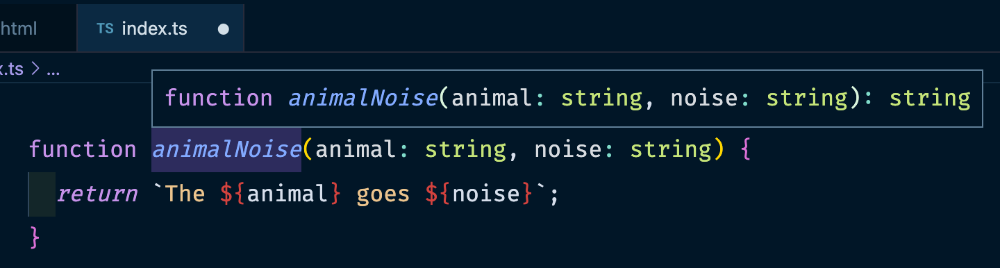
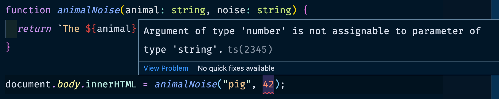
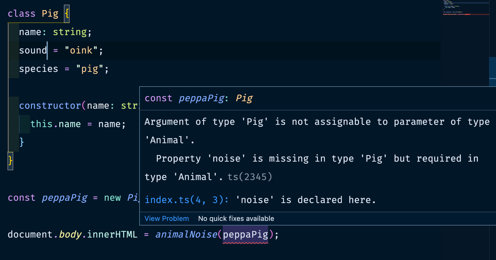

We're going to start learning TypeScript by writing a very simple program that makes animal noises 🐽

#### Install TypeScript

Before you can use TypeScript, you'll need to install it. You can do this easily with npm.

```
npm install -g typescript
```

#### Getting started

The first thing you should know is that TypeScript is just a _superset_ of JavaScript.
This means that your existing JS code is also TypeScript code. TS just adds an additional
layer on top, which is the type system.

To demonstrate this relationship between TS and JS, and to show how easy it is to move from
JavaScript to TypeScript, we are going to start by building a simple website with vanilla JS.

Create 2 files, `index.html` and `index.js`

```html
<!-- index.html -->
<!DOCTYPE html>
<html>
  <body>
    <script src="index.js"></script>
  </body>
</html>
```

```js
// index.js
function animalNoise(animal, noise) {
  return `The ${animal} goes ${noise}`;
}

document.body.innerHTML = animalNoise("pig", "oink");
```

If you open `index.html` in your browser, you will see your tiny website in action.


Not very exciting is it? And we haven’t even used TypeScript yet. Let's fix that.

#### Sprinkling in some TypeScript

Migrating our website from JS to TS is pretty easy.

First, rename `index.js` to `index.ts`. If you open the site in your browser again and refresh, you'll see that this has broken it.
The `index.js` that is referenced no longer exists.

Unfortunately, the browser does not understand the TypeScript type system, but it is very easy to
compile a TypeScript file into a JavaScript file. Run the following command to compile your TypeScript file.

```
tsc index.ts
```

You will see that this command has generated our `index.js` file from the TypeScript file, and our website works again!

For now, the contents of the 2 files are virtually the same, but once we start using
more TypeScript features you will see that they will get stripped out of the compiled
JS file.

#### Adding in some types

So you might be wondering what the point of Typescript is if all of the TypeScript types
get removed from the compiled code. Well, TypeScript gives you a lot more safety **while you are coding** and **when you build your project**.
If TypeScript isn't happy with your code, it won't compile, and this can catch lots of bugs.

Let's add some types to our TypeScript file.

```ts
function animalNoise(animal: string, noise: string) {
  return `The ${animal} goes ${noise}`;
}

document.body.innerHTML = animalNoise("pig", "oink");
```

The two `animal: string` and `noise: string` declarations indicate that this function
accepts two string arguments. TypeScript is also able to infer the return type of this
function. If you hover over the function name in VSCode it will tell you that it returns
a string.



You can run `tsc index.ts` again and see that it still compiles successfully. Notice that the
types are stripped out of the compiled JS file.

#### Type Errors

Let's cause a type error. We have told TypeScript that this function accepts two strings,
so let's give it a number instead 😈

```ts
function animalNoise(animal: string, noise: string) {
  return `The ${animal} goes ${noise}`;
}

document.body.innerHTML = animalNoise("pig", 42);
```

First of all, you should see that you get an error in your code editor.



This is one of the best things about the tooling around TypeScript! You get instant feedback
when you make a mistake.

If you now try and rerun `tsc index.js` you will get a compilation error:

```
Argument of type 'number' is not assignable to parameter of type 'string'.
```

This error is _good_ because TypeScript caught our mistake. Now we can fix it and try to compile it again.

#### Create your own types

The fundamental types like `string`, `number` or `boolean` are all very useful, but sometimes you
need to define your own types to describe a more complex object.

Take our function for example, if we added a third argument, `species`, it might be a good
idea to bring those 3 arguments together into a single object argument.

```ts
type Animal = {
  name: string;
  species: string;
  noise: string;
};

function animalNoise(animal: Animal) {
  return `${animal.name} the ${animal.species} goes ${animal.noise}`;
}

const peppaPig: Animal = {
  name: "Peppa",
  species: "pig",
  noise: "oink"
};

document.body.innerHTML = animalNoise(peppaPig);
```

There is a lot of new stuff going on here so let's break it down.

```ts
type Animal = {
  name: string;
  species: string;
  noise: string;
};
```

Here, we have declared a new type called `Animal`, which must have the 3 properties `name`, `species` and `noise` - all strings.

```ts
function animalNoise(animal: Animal) {
  return `${animal.name} the ${animal.species} goes ${animal.noise}`;
}
```

The `animalNoise` function now accepts a single argument, which must be an `Animal`.

```ts
const peppaPig: Animal = {
  name: "Peppa",
  species: "pig",
  noise: "oink"
};
```

Now we create the animal. `const peppaPig: Animal` defines the type of the variable. Try changing
any of those values to something that isn't a string, or removing one of the properties
and you will see that TS will give you an error.

If we compile the code again and refresh our browser window, everything should look good!


#### Classes

If you are familiar with es6 classes then you will feel at home using TypeScript classes, but there
are a few additional syntax features that I would encourage you to go and research yourself.

TypeScript is smart, so it can compare the types you pass into a function and check if they
match. So if you create a class that has `name`, `noise`, and `species` string properties, then
TypeScript will know that it matches the `Animal` type and we can still use it in our function.

```ts
class Pig {
  name: string;
  noise = "oink";
  species = "pig";

  constructor(name: string) {
    this.name = name;
  }
}

const peppaPig = new Pig("Peppa");

document.body.innerHTML = animalNoise(peppaPig);
```

It's worth noting that in TS there is a shorthand for creating public properties from
the arguments of the constructor. You could also write the above class like this.

```ts
class Pig {
  name: string;
  noise = "oink";
  species = "pig";

  constructor(public name: string) {}
}
```

What if we cause a type error to occur, for example instead of calling the property `noise` we call it `sound`? TypeScript we let us know.



We get a very useful error, telling us exactly what we have done wrong.

```
Property 'noise' is missing in type 'Pig' but required in type 'Animal'
```

#### Wrapping up

I hope this article has started to demystify TypeScript for you, and that you have started
to get an idea of what it is and how it works. It's not as scary as it first seems!

Obviously, there is a lot more to TypeScript than what I have described here, I would encourage
you to start building something in TypeScript and tackle any issues you have while you go.
I think that is the best way to fully get to grips with all its features!
